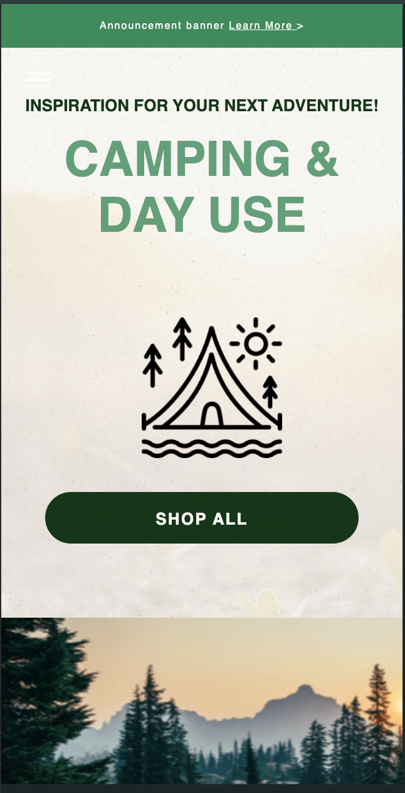
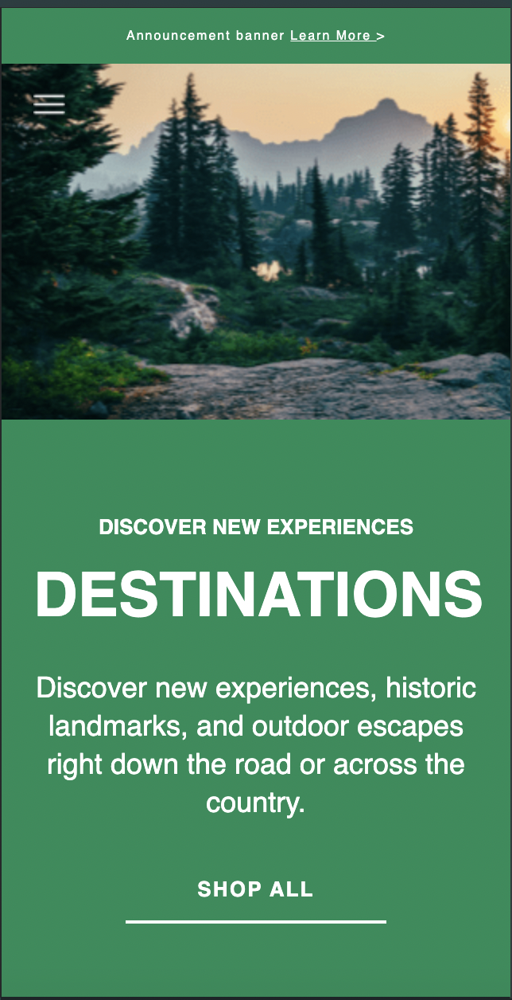

<!-- PROJECT LOGO -->
 

  

<h3 align="center">Camping landing page</h3>

  

    A responsive landing page for multiple devices
  

<!-- GETTING STARTED -->
## Introduction
### Description
* Developing a responsive landing page for multiple devices
* A personal project for applying at Pixelolabs

### Techniques

* Media queries responsive design
* CSS pseudo class
* CSS variables
* SEO optimization
* SCSS, LESS, SASS

### Requirement
1. Layout for 1440px (default)
2. "Extra Wide" layout for very large screens
3. "Mobile" layout spanning from 480px to 320px

### Screenshot

